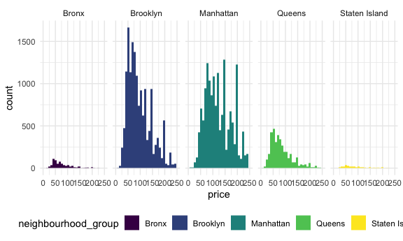
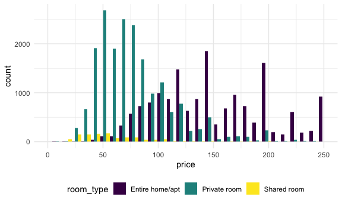
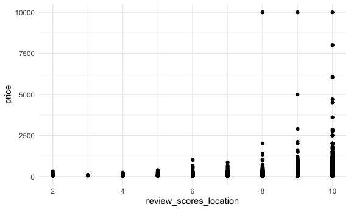
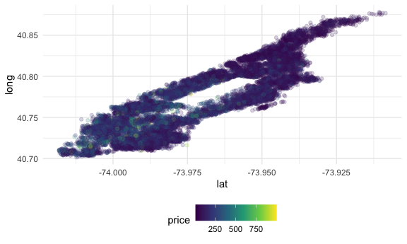
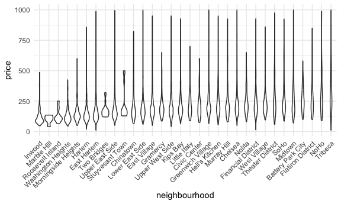

Case Study
================
Maya Krishnamoorthy
2024-10-08

Load key packages.

``` r
library(p8105.datasets)

data(nyc_airbnb)
```

## Brainstorm questions

- Where are max and min airbnb prices?
  - What are average prices?
  - What factors affect prices?

``` r
# Average prices
nyc_airbnb |> 
  summarize(
    min_price = min(price, na.rm = TRUE),
    max_price = max(price, na.rm = TRUE),
    avg_price = mean(price, na.rm = TRUE)
  )
```

    ## # A tibble: 1 × 3
    ##   min_price max_price avg_price
    ##       <dbl>     <dbl>     <dbl>
    ## 1        10     10000      145.

``` r
# Avg price by borough and neighborhood
nyc_airbnb |> 
  group_by(neighbourhood_group, neighbourhood) |> 
  summarize(
    avg_price = mean(price, na.rm = TRUE)
  )
```

    ## `summarise()` has grouped output by 'neighbourhood_group'. You can override
    ## using the `.groups` argument.

    ## # A tibble: 217 × 3
    ## # Groups:   neighbourhood_group [5]
    ##    neighbourhood_group neighbourhood     avg_price
    ##    <chr>               <chr>                 <dbl>
    ##  1 Bronx               Allerton               68.6
    ##  2 Bronx               Baychester             54  
    ##  3 Bronx               Belmont                55.4
    ##  4 Bronx               Bronxdale              65.2
    ##  5 Bronx               Castle Hill            85  
    ##  6 Bronx               City Island           143. 
    ##  7 Bronx               Claremont Village      51.6
    ##  8 Bronx               Clason Point           63.2
    ##  9 Bronx               Co-op City            116. 
    ## 10 Bronx               Concourse              87.9
    ## # ℹ 207 more rows

``` r
# Average price by borough
nyc_airbnb |> 
  group_by(neighbourhood_group) |> 
  summarize(
    avg_price = mean(price, na.rm = TRUE)
  )
```

    ## # A tibble: 5 × 2
    ##   neighbourhood_group avg_price
    ##   <chr>                   <dbl>
    ## 1 Bronx                    82.8
    ## 2 Brooklyn                120. 
    ## 3 Manhattan               180. 
    ## 4 Queens                   94.7
    ## 5 Staten Island           128.

``` r
# Graphical visualization of price distribution per borough
nyc_airbnb |> 
  ggplot(aes(x = price, fill = neighbourhood_group)) +
  geom_histogram() +
  facet_grid(. ~ neighbourhood_group) +
  scale_x_continuous(limits = c(0, 250))
```

    ## `stat_bin()` using `bins = 30`. Pick better value with `binwidth`.



``` r
# Does room type affect price
nyc_airbnb |> 
  group_by(room_type) |> 
  summarize(
    avg_price = mean(price, na.rm = TRUE)
  )
```

    ## # A tibble: 3 × 2
    ##   room_type       avg_price
    ##   <chr>               <dbl>
    ## 1 Entire home/apt     207. 
    ## 2 Private room         87.5
    ## 3 Shared room          70.2

``` r
# Graphical visualization of price distribution per room type
nyc_airbnb |> 
  ggplot(aes(x = price, fill = room_type)) +
  geom_histogram(position = "dodge") +
  scale_x_continuous(limits = c(0, 250))
```

    ## `stat_bin()` using `bins = 30`. Pick better value with `binwidth`.



- Where are prices going up and down over time?
- What’s the relationship between number of reviews and average reviews?
- Does room type affect availability?
- Are there repeat hosts?
  - If so, what does that mean?

``` r
nyc_airbnb %>%
  filter(calculated_host_listings_count > 34) %>%
  distinct(host_id, host_name, calculated_host_listings_count)
```

    ## # A tibble: 1 × 3
    ##    host_id host_name calculated_host_listings_count
    ##      <dbl> <chr>                              <dbl>
    ## 1 26377263 Stat                                  35

- Where is the unit located?
  - What areas are popular?

``` r
nyc_airbnb |> 
  group_by(neighbourhood_group, room_type) |> 
  summarize(mean_price = mean(price)) |> 
  pivot_wider(
    names_from = room_type,
    values_from = mean_price
  )
```

    ## `summarise()` has grouped output by 'neighbourhood_group'. You can override
    ## using the `.groups` argument.

    ## # A tibble: 5 × 4
    ## # Groups:   neighbourhood_group [5]
    ##   neighbourhood_group `Entire home/apt` `Private room` `Shared room`
    ##   <chr>                           <dbl>          <dbl>         <dbl>
    ## 1 Bronx                            125.           65.5          57.5
    ## 2 Brooklyn                         175.           76.7          59.6
    ## 3 Manhattan                        238.          107.           84.7
    ## 4 Queens                           140.           70.6          49.1
    ## 5 Staten Island                    207.           65.4          25

## Answeirng other questions

``` r
nyc_airbnb |> 
  ggplot(aes(x = review_scores_location, y = price)) +
  geom_point()
```



Impact of borough on price – Manhattan

``` r
nyc_airbnb |> 
  filter(
    neighbourhood_group == "Manhattan",
    price < 1000) |> 
  ggplot(aes(x = lat, y = long, color = price)) +
  geom_point(alpha = 0.2)
```



Summary table

``` r
nyc_airbnb |> 
  filter(
    neighbourhood_group == "Manhattan",
    price < 1000, 
    room_type == "Entire home/apt") |> 
  group_by(neighbourhood) |> 
  summarize(mean_price = mean(price, na.rm = TRUE)) |> 
  arrange(desc(mean_price))
```

    ## # A tibble: 32 × 2
    ##    neighbourhood      mean_price
    ##    <chr>                   <dbl>
    ##  1 Tribeca                  358.
    ##  2 NoHo                     312.
    ##  3 Flatiron District        307.
    ##  4 SoHo                     296.
    ##  5 Theater District         282.
    ##  6 Midtown                  276.
    ##  7 Battery Park City        271.
    ##  8 Greenwich Village        256.
    ##  9 Chelsea                  255.
    ## 10 Financial District       250.
    ## # ℹ 22 more rows

Visualization

``` r
nyc_airbnb |> 
  filter(
    neighbourhood_group == "Manhattan",
    price < 1000, 
    room_type == "Entire home/apt") |> 
  mutate(neighbourhood = fct_reorder(neighbourhood, price)) |> 
  ggplot(aes(x = neighbourhood, y = price)) +
  geom_violin() +
  theme(axis.text.x = element_text(angle = 45, vjust = 1, hjust = 1))
```



## Using leaflet
